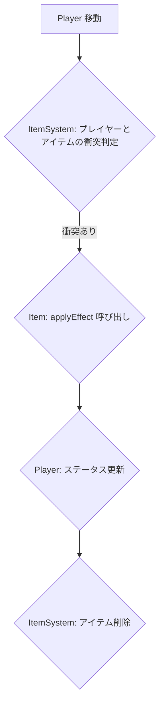

# Vampire Dungeon - 開発ドキュメント

このドキュメントは、Vampire Dungeonの開発者向けに、プロジェクトの内部設計や構造を簡潔に説明するものです。

## アーキテクチャ概要

このプロジェクトは以下の主要なコンポーネントで構成されています：

1.  **Three.js レンダリングエンジン** - 3Dグラフィックスの描画
2.  **ゲームエンティティシステム** - プレイヤー、敵、アイテムなどのゲーム要素
3.  **ゲームシステム** - 各機能の制御（敵AI、アイテム管理、レベル生成、スキル管理など）
4.  **物理・衝突システム** - 壁や障害物との衝突判定、視線判定など
5.  **React UI** - ゲーム情報の表示インターフェース

## プロジェクト構造

```
src/
  ├─ main.tsx           # アプリケーションのエントリーポイント
  ├─ App.tsx           # メインのReactコンポーネント
  ├─ assets/           # 画像、モデル、テクスチャなどのリソース
  │   ├─ maps/         # Tiledマップファイル (.tmj)
  │   └─ tombstone/    # 墓石モデル
  ├─ components/       # Reactコンポーネント
  │   └─ UI.tsx       # ゲーム内UI
  ├─ game/            # ゲームのコア機能
  │   ├─ GameManager.ts   # ゲーム全体の管理
  │   ├─ entities/    # ゲーム内のエンティティ
  │   │   ├─ Enemy.ts    # 敵の基底クラス
  │   │   ├─ Item.ts     # アイテムの実装
  │   │   ├─ JellySlime.ts # ジェリースライム（敵）の実装
  │   │   ├─ Player.ts   # プレイヤーの実装
  │   │   └─ Tombstone.ts # 墓石オブジェクトの実装
  │   ├─ skills/      # スキル関連
  │   │   ├─ SkillManager.ts # スキル管理
  │   │   └─ Skills.ts     # スキルの定義
  │   └─ systems/     # ゲームシステム
  │   │   ├─ EnemySystem.ts   # 敵の管理
  │   │   ├─ ItemSystem.ts    # アイテムの管理
  │   │   ├─ LevelPatterns1-1.ts # レベルパターン定義 (例)
  │   │   ├─ LevelSystem.ts   # 階層の生成と管理
  │   │   ├─ PathFindingSystem.ts # 経路探索システム
  │   │   └─ PlayerSystem.ts  # プレイヤーの入力と状態管理
  │   └─ __tests__/    # テストファイル
  │       ├─ GameManager.test.ts
  │       └─ PathFindingSystem.test.ts
  └─ styles/          # CSSスタイル
      ├─ App.css     # アプリケーション全体のスタイル
      ├─ index.css   # グローバルスタイル
      └─ UI.css      # UI用のスタイル
```

## クラス設計

### GameManager

`GameManager`はゲーム全体を管理する中核クラスで、以下の責務を持ちます：

- Three.jsのシーン、カメラ、レンダラーの初期化と管理
- 各システム（プレイヤー、敵、アイテム、レベル、スキル）の初期化と統合
- システム間の参照設定（PlayerSystemにLevelSystemを渡すなど）
- ゲームループの制御
- リソースの管理とクリーンアップ

```typescript
// GameManager.ts の主要インターフェース例
export class GameManager {
  constructor(container: HTMLElement); // ゲームを描画するHTML要素を受け取る
  public dispose(): void; // リソースを解放する
  // ... 他の主要な公開メソッド (例: start, pause)
}
```

### エンティティクラス

ゲーム内のオブジェクトを表現するクラスです。

#### Player

プレイヤーキャラクターを表現し、以下の主要な機能を持ちます：

- 移動とアニメーション
- ステータス管理（体力、経験値、マナなど）
- 武器とアイテムの管理
- スキルの習得と使用

```typescript
// Player.ts の主要インターフェース例
export class Player {
  public mesh: THREE.Object3D; // プレイヤーの3Dモデル
  public dispose(): void; // リソースを解放する
  public addSkill(skillId: string): void; // スキルを習得
  public canUseSkill(skillId: string): boolean; // スキル使用可能かチェック (マナ、クールダウン)
  public useSkill(skillId: string): void; // スキル使用 (マナ消費、クールダウン開始)
  // ... 他の主要な公開メソッド (例: move, attack, useItem)
}
```

#### Enemy

敵キャラクターを表現し、以下の主要な機能を持ちます：

- プレイヤーへの追跡AI
- 視認範囲と視認状態の管理
- 攻撃と体力システム
- ドロップアイテム

```typescript
// Enemy.ts の主要インターフェース例
export class Enemy {
  public mesh: THREE.Object3D; // 敵の3Dモデル
  public dispose(): void; // リソースを解放する
  // ... 他の主要な公開メソッド (例: updateAI, takeDamage)
}
```

#### Item

ゲーム内のアイテムを表現し、以下の主要な機能を持ちます：

- 各種アイテムタイプ（回復、武器、スピード、パワー）
- 視覚効果（回転、浮動アニメーション）

```typescript
// Item.ts の主要インターフェース例
export type ItemType = 'health' | 'weapon' | 'speed' | 'power';

export class Item {
  public mesh: THREE.Object3D; // アイテムの3Dモデル
  public dispose(): void; // リソースを解放する
  // ... 他の主要な公開メソッド (例: applyEffect)
}
```

### システムクラス

ゲームの各機能を管理するシステムクラスです。

#### PlayerSystem

プレイヤーの入力処理と状態管理を担当します。主な特徴は以下の通りです：

- キーボード（WASD/矢印キー）による直接移動(廃止予定)
- 右クリックによる高度な経路探索移動
- スキルキー（QWER）入力の処理
- 滑らかな回転と移動の制御
- 壁との衝突判定と回避

```typescript
// PlayerSystem.ts の主要インターフェース例
export class PlayerSystem {
  constructor(scene: THREE.Scene, camera: THREE.Camera); // シーンとカメラを受け取る
  public dispose(): void; // リソースを解放する
  public update(deltaTime: number): void; // フレームごとの更新処理
  // ... 他の主要な公開メソッド (例: handleInput, moveTo)
}
```

#### 右クリック移動システム

右クリックによる移動は以下の手順で処理されます：

1.  **目標位置の決定**
    - マウス位置からレイキャストで地面との交点を計算
    - 障害物との安全距離をチェックし、必要に応じて位置を調整
2.  **経路探索**
    - PathFindingSystemを使用して最適経路を計算
    - 経路が見つかった場合は緑色のエフェクトを表示
    - 経路が見つからない場合は赤色のエフェクトを表示
3.  **移動の実行**
    - パス上の各ウェイポイントに向かって移動
    - 曲がり角での速度調整（減速）
    - 滑らかな方向転換
4.  **視覚的フィードバック**
    - 移動先のクリックエフェクト表示
    - 経路の可視化（デバッグモード）
    - エフェクトのアニメーション

##### 右クリック移動データフロー

```mermaid
graph TD
    A[右クリック入力] --> B{PlayerSystem: マウス位置取得};
    B --> C{レイキャストで地面との交点計算};
    C --> D{障害物チェック & 位置調整};
    D --> E{目標位置決定};
    E --> F[PathFindingSystem: 経路探索];
    F -- 経路あり --> G[経路エフェクト表示(緑)];
    F -- 経路なし --> H[経路エフェクト表示(赤)];
    G --> I{PlayerSystem: 移動開始};
    I --> J{Player: ウェイポイントへ移動};
    J --> K{LevelSystem: 衝突判定};
    K -- 衝突なし --> J;
    K -- 衝突あり --> L[移動停止/調整];
    J -- 次のウェイポイント --> J;
    J -- 最終地点到達 --> M[移動完了];
```

#### EnemySystem

敵の生成、AI、状態管理を担当します：

```typescript
// EnemySystem.ts の主要インターフェース例
export class EnemySystem {
  constructor(scene: THREE.Scene); // シーンを受け取る
  public dispose(): void; // リソースを解放する
  public update(deltaTime: number): void; // フレームごとの更新処理
  // ... 他の主要な公開メソッド (例: spawnEnemy, updateEnemies)
}
```

##### 敵AIデータフロー

```mermaid
graph TD
    A[EnemySystem Update] --> B{敵ごとに処理};
    B --> C{プレイヤーとの距離チェック};
    C -- 範囲内 --> D{視線判定 (レイキャスト)};
    C -- 範囲外 --> E[待機/巡回];
    D -- 視認可能 --> F[追跡状態へ移行];
    D -- 視認不可 --> E;
    F --> G{Enemy: プレイヤーへ移動 (PathFindingSystem利用)};
    G --> H{LevelSystem: 衝突判定};
    H -- 衝突なし --> G;
    H -- 衝突あり --> I[移動停止/調整];
    G --> J{攻撃範囲チェック};
    J -- 範囲内 --> K[Enemy: 攻撃実行];
    J -- 範囲外 --> G;
```

#### ItemSystem

アイテムの生成、収集、効果適用を担当します：

```typescript
// ItemSystem.ts の主要インターフェース例
export class ItemSystem {
  constructor(scene: THREE.Scene); // シーンを受け取る
  public dispose(): void; // リソースを解放する
  public update(deltaTime: number): void; // フレームごとの更新処理
  // ... 他の主要な公開メソッド (例: spawnItem, checkCollection)
}
```

##### アイテム取得データフロー



#### LevelSystem

階層の生成と管理を担当します：

```typescript
// LevelSystem.ts の主要インターフェース例
export class LevelSystem {
  constructor(scene: THREE.Scene); // シーンを受け取る
  public dispose(): void; // リソースを解放する
  public checkWallCollision(boundingBox: THREE.Box3): boolean; // 壁との衝突判定
  // ... 他の主要な公開メソッド (例: generateLevel, getSpawnPoint)
}
```

LevelSystemは以下の主要な責務を持ちます：

1.  **固定パターンのダンジョン生成**
    - 各階層ごとに定義された固定マップの管理
    - 出口位置の設定と階層間移動の制御
    - 各階層の特徴的なレイアウト実装
2.  **レベル管理**
    - 現在のフロア番号の管理（1階から3階）
    - フロア間の遷移処理
    - 各フロアの難易度調整
3.  **マップ構造**
    - 各階層1種類の固定マップパターン
    - 1階：初期エリア（比較的シンプルな構造）
    - 2階：中間エリア（複雑な部屋の配置）
    - 3階：最終エリア（ボス戦を想定した広い空間）
4.  **マップ要素**
    - 固定壁：部屋の外周を形成する壁
    - 柱：部屋内の障害物として機能する柱
    - 階段：階層間移動のための出口
5.  **最適化と拡張性**
    - 将来的なマップパターン追加を考慮した設計
    - マップデータの効率的な管理
    - 階層ごとの特殊ギミックの実装準備

## 物理・衝突システム

### バウンディングボックスによる衝突判定

各ゲームオブジェクト（プレイヤー、敵、壁など）は`THREE.Box3`のバウンディングボックスを持ち、衝突判定に使用します。

```typescript
// バウンディングボックスの作成と更新
this.mesh.userData.boundingBox = new THREE.Box3().setFromObject(this.mesh);

// 衝突判定の例 (PlayerSystem内)
if (this.levelSystem.checkWallCollision(playerBoundingBox)) {
  // 衝突時の処理（元の位置に戻すなど）
  this.player.mesh.position.copy(oldPosition);
}
```

### 敵の視線判定システム

敵がプレイヤーを視認できるかどうかを判定するシステムは、レイキャスティングを使用して実装されています。

```typescript
// 視線判定の概略（EnemySystem内）
private checkPlayerDetection(enemy: Enemy, playerPosition: THREE.Vector3): boolean {
  // 距離チェック
  const distance = enemy.mesh.position.distanceTo(playerPosition);
  if (distance > enemy.detectionRange) return false;

  // 視線チェック
  const direction = playerPosition.clone().sub(enemy.getPosition()).normalize();
  this.raycaster.set(enemy.getPosition(), direction);

  // 壁との交差をチェック
  const walls = this.levelSystem.getWalls(); // LevelSystemから壁オブジェクトを取得
  const intersections = this.raycaster.intersectObjects(walls);
  if (intersections.length > 0 && intersections[0].distance < distance) {
    return false;  // 視線が壁に遮られている
  }

  return true;  // 視認可能
}
```

### 視覚的デバッグ支援

敵の視認範囲は視覚的に表示できるようになっており、以下の色で状態を示します：

- 黄色: プレイヤーを検知していない状態
- 赤色: プレイヤーを検知している状態

これにより、壁による視線の遮断が視覚的に確認できます。

## システム間の連携

GameManagerは、各システム間の連携を以下のように管理しています：

```typescript
// システム間連携の例（GameManager.init()内）
this.playerSystem.setLevelSystem(this.levelSystem);
this.playerSystem.setSkillManager(this.skillManager); // SkillManagerを追加
this.enemySystem.setPlayer(player);
this.enemySystem.setLevelSystem(this.levelSystem);
this.itemSystem.setPlayer(player);
this.skillManager.setPlayer(player); // PlayerをSkillManagerに設定
```

このように依存関係を注入することで、各システムは必要な情報を取得し、互いに協調して機能します。

## React UI コンポーネント

ゲーム情報を表示するReactコンポーネントです：

```typescript
// UI.tsx の概略
function UI(props: UIProps) {
  // ステータス表示（体力、経験値、マナなど）
  // 武器・アイテム表示
  // ダンジョンレベル表示
  // スキルスロット表示 (QWER)
  // スキル選択UI (レベルアップ時など)
}
```

## ゲームの初期化フロー

1.  Reactアプリケーションがマウントされる
2.  `App`コンポーネントがレンダリングされる
3.  `useEffect`内で`GameManager`がインスタンス化される
4.  `GameManager.init()`が各システムを初期化
    - LevelSystemが初期化される
    - Playerが初期化される
    - SkillManagerが初期化され、Playerに設定される
    - PlayerSystemが初期化される
    - EnemySystemが初期化される
    - ItemSystemが初期化される
    - システム間の参照が設定される
5.  `GameManager.start()`がゲームループを開始

## データフロー概要

1.  **ユーザー入力:**
    - キーボード（移動、スキル）→ `PlayerSystem` → `Player`の移動 or `SkillManager`経由でスキル実行
    - マウス（右クリック移動）→ `PlayerSystem` → `PathFindingSystem` → `Player`の移動
2.  **移動と衝突:**
    - `Player`移動 → `LevelSystem.checkWallCollision()` → 衝突判定と位置修正
    - `Enemy`移動 → `LevelSystem.checkWallCollision()` → 衝突判定と位置修正
3.  **敵AI:**
    - `EnemySystem.update()` → 敵の視線判定 → 追跡/攻撃 → `PathFindingSystem`利用
4.  **アイテム取得:**
    - `Player`移動 → `ItemSystem.checkCollection()` → 衝突判定 → `Item.applyEffect()` → `Player`ステータス更新
5.  **スキル実行:**
    - `PlayerSystem` (キー入力) → `SkillManager.executeSkill()` → `Player` (マナ/クールダウン確認) → `Skill.execute()` → 効果適用
6.  **ゲームループ:**
    - `GameManager`が各システムの`update`メソッドを呼び出す
    - 各システムが関連エンティティを更新
    - 衝突検出と相互作用の処理
    - UIの更新（React状態の更新、`GameManager`からUIへ情報伝達）
    - Three.jsによるシーンのレンダリング

## 拡張方法

### 新しい敵タイプの追加

1.  `Enemy.ts`を拡張するか新しいクラスを作成 (`src/game/entities/NewEnemy.ts`)
2.  `EnemySystem`に新しい敵タイプの生成ロジックを追加 (`spawnNewEnemy`など)
3.  必要に応じて敵のAIロジックを`NewEnemy.ts`または`EnemySystem`に実装

### 新しいアイテムタイプの追加

1.  `Item.ts`の`ItemType`を拡張 (`export type ItemType = ... | 'newType';`)
2.  `ItemSystem.applyItemEffect`に新しい効果を追加
3.  必要に応じて`Item.ts`に新しいプロパティやメソッドを追加

### 新しい武器システムの追加

1.  新しい`Weapon`クラスの作成 (`src/game/entities/Weapon.ts`)
2.  `Player`クラスに武器管理メソッドを追加 (`equipWeapon`, `attackWithWeapon`など)
3.  `PlayerSystem`または`GameManager`で攻撃入力とロジックを実装

### 衝突判定の拡張

1.  新しい衝突タイプ（例: 罠、特定の地形効果）に対応するオブジェクトクラスを作成
2.  必要に応じて`LevelSystem`に新たな衝突判定メソッドを追加 (`checkTrapCollision`など)
3.  該当するシステムクラス（例: `PlayerSystem`）で新しい衝突判定を利用

## パフォーマンス最適化

- オブジェクトプーリングの使用（敵、アイテム、エフェクトなど）
- 空間分割（例: Octree）による衝突判定や視線判定の最適化
- レベルのチャンク分割（大規模マップの場合）
- LOD（Level of Detail）システムの実装（モデルの複雑度を距離に応じて変更）
- シェーダーの最適化（複雑な計算をGPUで行う）
- 不要なオブジェクトの描画カリング

## 既知の課題と今後の対応

1.  対角線上の壁の衝突判定の最適化（より滑らかな移動のため）
2.  パスファインディングAIの改善（敵がより賢く障害物を迂回する）
3.  モバイル対応（タッチ操作、パフォーマンス調整）
4.  セーブ/ロードシステムの実装
5.  サウンドシステムの追加（効果音、BGM）
6.  より多様なレベル生成アルゴリズムの検討

## ビルドと展開

```bash
# 開発ビルド (HMR有効)
npm run dev

# 本番ビルド (最適化済み)
npm run build

# ビルドのプレビュー
npm run preview
```

ビルドされたファイルは`dist`ディレクトリに出力されます。静的ファイルサーバーでホスティング可能です。

## スキルシステム

プレイヤーのスキルシステムは以下のように設計されています：

### スキルの型と属性

スキルは`Skills.ts`で定義される`Skill`インターフェースに従います。

```typescript
// Skills.ts より
export interface Skill {
  id: string; // スキルID (例: 'magicOrb')
  name: string; // スキルの表示名 (例: '魔法のオーブ')
  cooldown: number; // クールダウン時間（秒）
  manaCost: number; // マナコスト
  execute: (
    // スキル実行関数
    player: Player, // スキル使用者
    direction?: THREE.Vector3, // スキル方向 (必要な場合)
    getEnemies?: () => Enemy[], // 周囲の敵を取得する関数 (必要な場合)
  ) => void;
}
```

スキルの実装例は`Skills`クラスで定義され、`SkillDatabase`に登録されます。

```typescript
// Skills.ts より
export const SkillDatabase: { [key: string]: Skill } = {
  magicOrb: {
    id: 'magicOrb',
    name: '魔法のオーブ',
    cooldown: 6,
    manaCost: 15,
    execute: Skills.magicOrb, // Skillsクラスの静的メソッドを参照
  },
  // ...他のスキル (例: dash, heal)
};
```

### スキル管理・バインド・実行

スキルの管理は`SkillManager.ts`の`SkillManager`クラスが担当します。主な機能は以下の通りです。

- スキルの登録・取得・説明生成
- プレイヤーへのスキル追加・習得 (`Player`クラスと連携)
- QWERキーへのスキルバインド・解除 (`Player`クラスにバインド情報を保持)
- スキルの実行要求 (`PlayerSystem`から呼び出し)
- 未習得スキルの抽出・ランダム取得 (レベルアップ時など)

#### SkillManagerの主要API例

```typescript
// SkillManager.ts より
export class SkillManager {
  private player: Player | null = null; // 関連付けるプレイヤー

  public static getInstance(): SkillManager;
  public setPlayer(player: Player): void; // プレイヤーを設定
  public registerSkill(skill: Skill): void; // スキルをデータベースに登録 (通常は初期化時に行う)
  public getSkill(skillId: string): Skill | undefined; // スキル情報を取得
  public addSkillToPlayer(skillId: string): boolean; // プレイヤーにスキルを習得させる
  public bindSkillToKey(skillId: string, key: string): boolean; // スキルをキーにバインド (Player側で管理)
  public executeSkillByKey(
    key: string,
    direction?: THREE.Vector3,
    getEnemies?: () => Enemy[],
  ): boolean; // キーに対応するスキルを実行
  public executeSkillById(
    skillId: string,
    direction?: THREE.Vector3,
    getEnemies?: () => Enemy[],
  ): boolean; // IDでスキルを実行
  public getSkillDescription(skillId: string): string; // スキルの説明文を生成
  public getBindableSkills(): Skill[]; // プレイヤーが習得済みのスキルリストを取得
  public getBoundSkills(): { [key: string]: Skill | undefined }; // 現在バインドされているスキルを取得
  // ...他、詳細は実装参照
}
```

#### スキルの習得・バインド・実行フロー

1.  **スキルの習得**
    - 例: レベルアップ時やアイテム使用時
    - `SkillManager.addSkillToPlayer(skillId)`を呼び出す。内部で`Player.addSkill(skillId)`を実行。
2.  **スキルのバインド**
    - 例: UIからプレイヤーが選択
    - `SkillManager.bindSkillToKey(skillId, key)`を呼び出す。内部で`Player.bindSkill(skillId, key)`を実行。
    - 空きスロットへの自動バインドも可能 (`Player.bindSkillToEmptySlot(skillId)`)
3.  **スキルの実行**
    - `PlayerSystem`がキー入力（Q/W/E/R）を検知
    - `SkillManager.executeSkillByKey(key, direction, getEnemies)`を呼び出す。
    - `SkillManager`は`Player.canUseSkill(skillId)`でマナとクールダウンをチェック。
    - 使用可能なら`SkillDatabase`から`execute`関数を取得し実行。
    - `Player.useSkill(skillId)`を呼び出してマナ消費とクールダウン開始を記録。

##### スキル実行データフロー

```mermaid
graph TD
    A[キー入力 (Q/W/E/R)] --> B{PlayerSystem: 入力検知};
    B --> C{SkillManager: executeSkillByKey(key)};
    C --> D{Player: getBoundSkillId(key)};
    D --> E{Player: canUseSkill(skillId)};
    E -- OK --> F{SkillDatabase: getSkill(skillId).execute()};
    E -- NG (マナ不足/クールダウン中) --> G[実行失敗 (UIフィードバック)];
    F --> H{Player: useSkill(skillId)};
    H --> I[エフェクト表示/効果適用];
    I --> J[クールダウン開始];
```

#### サンプルコード (PlayerSystem内での呼び出し例)

```typescript
// PlayerSystem.ts (handleInputなど)
if (Input.isKeyPressed('Q')) {
  const success = this.skillManager.executeSkillByKey('Q', direction, () =>
    this.enemySystem.getNearbyEnemies(),
  );
  if (!success) {
    // UIにフィードバック (例: 音、エフェクト)
  }
}
```

#### スキルの説明生成

`SkillManager.getSkillDescription(skillId)`でスキルIDに基づいて、`SkillDatabase`の情報（名前、コスト、クールダウンなど）から説明文を動的に生成します。

#### UI用スキル選択肢データ

`SkillManager.getBindableSkills()`や`SkillManager.getBoundSkills()`を使用して、UIに表示するスキルリストや現在のバインド状況のデータを取得できます。

---

このように、`SkillManager`がスキルのデータベースと実行要求の仲介役となり、`Player`クラスが実際のスキル習得状態、マナ、クールダウン、キーバインドを管理することで、責務を分離し拡張性の高いスキルシステムを実現しています。
